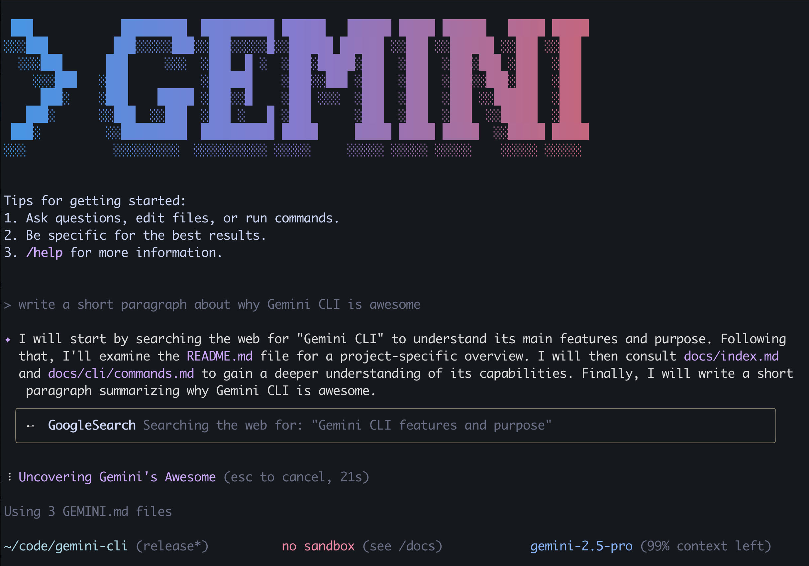

# Gemini Collaborative Suite for Discord - Backend

This repository contains the backend services for the **Gemini Collaborative Suite**, a powerful application designed to supercharge Discord servers with Google's Gemini AI. This backend is built with Next.js and Genkit, providing a robust and scalable foundation for intelligent, collaborative features.

## 🚀 Features

The backend exposes several Genkit flows that power the Discord bot's functionality:

- **Code Analysis**: Analyzes code snippets for bugs, vulnerabilities, and suggests improvements.
- **Image Generation**: Creates images from textual descriptions using generative AI.
- **Dynamic Workflows**: Allows for the creation and execution of custom, multi-step workflows within Discord.
- **Usage Tracking**: Monitors and reports on API usage and other metrics.
- **GitHub Integration**: Handles webhooks from GitHub to provide seamless integration with development workflows.
- **Multimodal Content Processing**: Can process and understand content that includes both text and images.
- **Secure API Key Management**: Securely manages user-specific API keys.
- **Conversation Summarization**: Summarizes long conversations in Discord channels to quickly catch up.
- **Web-Assisted Answers**: Answers questions by searching the web to provide the most up-to-date information.

## Project Structure

The project is organized as a monorepo with the main Next.js backend and a separate directory for the Discord bot client.

```
.
├── bot-client/         # Source code for the Discord bot client
├── src/
│   ├── ai/
│   │   ├── flows/      # Core Genkit AI flows that define the business logic
│   │   └── middleware/ # Middleware for handling requests
│   ├── app/            # Next.js API routes and pages
│   ├── components/     # React components for the frontend
│   ├── lib/            # Core libraries and utilities (Firebase, etc.)
│   ├── models/         # Data models and types
│   └── services/       # Services for interacting with external APIs (Discord, etc.)
├── Dockerfile          # Container configuration for deployment
├── apphosting.yaml     # Configuration for Google Cloud App Hosting
└── package.json        # Project dependencies and scripts
```

## Getting Started

This is a Next.js backend service. The primary interaction points are the Genkit flows defined in `src/ai/flows/`. The Discord bot client (in `bot-client/`) will make API calls to these flows.

### Prerequisites

- Node.js (v18 or higher)
- A Google Cloud project with the Gemini API enabled.
- A Firebase project for authentication and database services.
- A `.env.local` file with your `GOOGLE_API_KEY` and Firebase configuration.

### Running Locally

1.  **Install Dependencies:**
    ```bash
    npm install
    ```

2.  **Start the Genkit Development Server:**
    This server provides a UI for testing and managing your AI flows.
    ```bash
    npm run genkit:start
    ```
    The Genkit UI will be available at `http://localhost:4001`.

3.  **Start the Next.js Development Server:**
    ```bash
    npm run dev
    ```
    The application will be running at `http://localhost:3000`.

## 部署 (Deployment)

This application is designed to be deployed on **Google Cloud App Hosting**. The `apphosting.yaml` and `Dockerfile` provide the necessary configuration for a seamless deployment.

Detailed deployment instructions will be added soon.
=======
# Gemini CLI

[](https://github.com/google-gemini/gemini-cli/actions/workflows/ci.yml)



This repository contains the Gemini CLI, a command-line AI workflow tool that connects to your
tools, understands your code and accelerates your workflows.

With the Gemini CLI you can:

- Query and edit large codebases in and beyond Gemini's 1M token context window.
- Generate new apps from PDFs or sketches, using Gemini's multimodal capabilities.
- Automate operational tasks, like querying pull requests or handling complex rebases.
- Use tools and MCP servers to connect new capabilities, including [media generation with Imagen,
  Veo or Lyria](https://github.com/GoogleCloudPlatform/vertex-ai-creative-studio/tree/main/experiments/mcp-genmedia)
- Ground your queries with the [Google Search](https://ai.google.dev/gemini-api/docs/grounding)
  tool, built in to Gemini.

## Quickstart

1. **Prerequisites:** Ensure you have [Node.js version 18](https://nodejs.org/en/download) or higher installed.
2. **Run the CLI:** Execute the following command in your terminal:

   ```bash
   npx https://github.com/google-gemini/gemini-cli
   ```

   Or install it with:

   ```bash
   npm install -g @google/gemini-cli
   gemini
   ```

3. **Pick a color theme**
4. **Authenticate:** When prompted, sign in with your personal Google account. This will grant you up to 60 model requests per minute and 1,000 model requests per day using Gemini.

You are now ready to use the Gemini CLI!

### For advanced use or increased limits:

If you need to use a specific model or require a higher request capacity, you can use an API key:

1. Generate a key from [Google AI Studio](https://aistudio.google.com/apikey).
2. Set it as an environment variable in your terminal. Replace `YOUR_API_KEY` with your generated key.

   ```bash
   export GEMINI_API_KEY="YOUR_API_KEY"
   ```

For other authentication methods, including Google Workspace accounts, see the [authentication](./docs/cli/authentication.md) guide.

## Examples

Once the CLI is running, you can start interacting with Gemini from your shell.

You can start a project from a new directory:

```sh
cd new-project/
gemini
> Write me a Gemini Discord bot that answers questions using a FAQ.md file I will provide
```

Or work with an existing project:

```sh
git clone https://github.com/google-gemini/gemini-cli
cd gemini-cli
gemini
> Give me a summary of all of the changes that went in yesterday
```

### Next steps

- Learn how to [contribute to or build from the source](./CONTRIBUTING.md).
- Explore the available **[CLI Commands](./docs/cli/commands.md)**.
- If you encounter any issues, review the **[Troubleshooting guide](./docs/troubleshooting.md)**.
- For more comprehensive documentation, see the [full documentation](./docs/index.md).
- Take a look at some [popular tasks](#popular-tasks) for more inspiration.

### Troubleshooting

Head over to the [troubleshooting](docs/troubleshooting.md) guide if you're
having issues.

## Popular tasks

### Explore a new codebase

Start by `cd`ing into an existing or newly-cloned repository and running `gemini`.

```text
> Describe the main pieces of this system's architecture.
```

```text
> What security mechanisms are in place?
```

### Work with your existing code

```text
> Implement a first draft for GitHub issue #123.
```

```text
> Help me migrate this codebase to the latest version of Java. Start with a plan.
```

### Automate your workflows

Use MCP servers to integrate your local system tools with your enterprise collaboration suite.

```text
> Make me a slide deck showing the git history from the last 7 days, grouped by feature and team member.
```

```text
> Make a full-screen web app for a wall display to show our most interacted-with GitHub issues.
```

### Interact with your system

```text
> Convert all the images in this directory to png, and rename them to use dates from the exif data.
```

```text
> Organise my PDF invoices by month of expenditure.
```

## Terms of Service and Privacy Notice

For details on the terms of service and privacy notice applicable to your use of Gemini CLI, see the [Terms of Service and Privacy Notice](./docs/tos-privacy.md).
